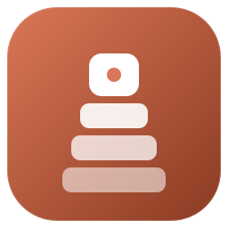

<p align="center">
  
</p>

<p align="center">
  <a href="https://github.com/amer313/homebrew-tap"></a>
  <a href="https://github.com/amer313/claude-sessions/releases"></a>
  <a href="LICENSE"></a>
  
</p>

# claude-sessions

Auto-resume all your Claude Code sessions after a Mac restart.

- 🔁 Every open `claude` CLI session is resumed automatically on login
- 🪟 Opens as named tabs inside a single terminal window (not 20 scattered ones)
- 📋 Optional menu bar item with live session count and one-click focus
- 🧹 Auto-prunes dead session files (missing CWD or older than N days)
- 📦 Homebrew tap — one command install, `brew upgrade` to update

## How it works

Claude Code tracks live sessions in `~/.claude/sessions/<PID>.json`. These files survive a restart, but the processes die. On login, this tool reads those files, finds dead PIDs, and resumes each one with `claude --resume <session-id>` — by default, as named tabs inside a single terminal window instead of N separate windows.

A lightweight backup daemon (every 5 min) keeps a safety-net copy in case the session files get cleaned up before restore runs. The same daemon prunes stale entries so nothing piles up.

## Install

### Homebrew (recommended)

```bash
brew install amer313/tap/claude-sessions && claude-sessions setup
```

`brew upgrade claude-sessions` picks up new versions; no need to re-run `setup`.

Skip the menu bar: `claude-sessions setup --no-menubar`.

> Homebrew's `post_install` runs in a sandbox that blocks writes to `~/Library/LaunchAgents/`, so the setup step has to run from your shell. One command, one time.

### curl (true one-liner)

```bash
curl -fsSL https://raw.githubusercontent.com/amer313/claude-sessions/main/install.sh | bash
```

Skip the menu bar:

```bash
curl -fsSL https://raw.githubusercontent.com/amer313/claude-sessions/main/install.sh | bash -s -- --no-menubar
```

## Usage

```
claude-sessions status              # What's running now
claude-sessions restore             # Manually resume dead sessions
claude-sessions prune [days]        # Remove dead session files older than N days
claude-sessions disable             # Skip next auto-restore
claude-sessions enable              # Re-enable auto-restore
claude-sessions menubar install     # Add menu bar item (optional)
claude-sessions menubar uninstall   # Remove menu bar item
claude-sessions uninstall           # Remove everything
```

## Menu bar item (optional)

```bash
claude-sessions menubar install
```

<p align="center">
  
</p>

A small totem icon (the project mark) appears in your menu bar alongside the live session count.

Click the icon to:

- See live sessions — click any to jump straight to its iTerm2 tab
- See stale sessions waiting for the next restore
- **Restore Now** — resume everything dead
- **Disable/Enable Auto-Restore**
- **Open Logs** / **Open Config**

It's pure Python (`rumps`), runs under its own LaunchAgent, and uses a dedicated venv so it doesn't depend on system Python. The icon is a template image — macOS automatically recolors it for light/dark menu bars.

## Config

Edit `~/.claude/session-manager/config`:

```bash
# Extra flags passed to `claude` on resume
CLAUDE_RESUME_FLAGS="--dangerously-skip-permissions"

# Terminal override: "iTerm2" or "Terminal" (auto-detected if empty)
TERMINAL=""

# Restore layout:
#   tabs    — one window with one tab per session (default)
#   windows — one window per session (old behavior)
#   tmux    — one tmux session "claude" with one window per session
LAYOUT="tabs"

# Auto-prune dead session files older than N days (snapshot daemon does this).
# Also always prunes dead sessions whose CWD no longer exists. Set 0 to disable.
PRUNE_DAYS=7
```

### Layouts

**`tabs` (default)** — One window titled `Claude Sessions (N)` with one named tab per session. Tab names use the session name, or the CWD basename if unnamed. Keeps your desktop clean with many sessions.

**`windows`** — Legacy behavior: one new terminal window per session. Useful if you prefer spatial separation over tabs.

**`tmux`** — Creates (or reuses) a tmux session named `claude` with one window per Claude session. Attach with `tmux attach -t claude`. Best for power users comfortable with tmux. Requires `tmux` on `$PATH`.

### Auto-prune

The snapshot daemon (runs every 5 min) automatically drops stale session files:

- **Always**: any dead-PID session whose `cwd` no longer exists on disk
- **By age**: dead-PID sessions older than `PRUNE_DAYS` days (default 7)

`PRUNE_DAYS=0` disables the age-based pruning; CWD-missing cleanup still runs. For a manual pass with a custom window: `claude-sessions prune 14`.

## What happens on restart

1. Mac restarts, all Claude processes die
2. You log in
3. 10 seconds later, the restore agent reads the backup / session files
4. Opens a single terminal window with one tab per dead session (default layout)
5. Each tab runs `claude --resume <session-id>` in the original directory
6. macOS notification confirms how many were restored

## Requirements

- macOS (uses LaunchAgents + AppleScript)
- Python 3 (ships with macOS; menu bar needs Python 3.10+ — handled automatically via venv)
- Claude Code CLI on `$PATH`
- `tmux` — only if you set `LAYOUT=tmux`

## Architecture

```
~/.claude/
├── sessions/                     # written by Claude Code
│   └── <pid>.json                # one file per live session
└── session-manager/
    ├── claude-sessions           # the CLI (or symlink to brew binary)
    ├── claude-sessions-menubar.py
    ├── menubar-icon.png          # totem template image
    ├── config                    # user settings
    ├── backup-manifest.json      # safety-net copy, written every 5min
    ├── venv/                     # python venv for the menu bar app
    └── logs/
        ├── claude-sessions.log   # ring-buffered, last ~1000 lines
        ├── snapshot-std{out,err}.log
        ├── restore-std{out,err}.log
        └── menubar-std{out,err}.log

~/Library/LaunchAgents/
├── com.claude.session-snapshot.plist   # every 5 min
├── com.claude.session-restore.plist    # at login
└── com.claude.session-menubar.plist    # at login, kept alive
```

## Releasing (for maintainers)

Tagging `vX.Y.Z` on `main` triggers `.github/workflows/bump-tap.yml`, which:

1. Downloads the tag tarball and computes its sha256
2. Updates `Formula/claude-sessions.rb` in the [amer313/homebrew-tap](https://github.com/amer313/homebrew-tap) repo
3. Commits and pushes the bump

Requires a repo secret `TAP_PUSH_TOKEN` — a fine-grained PAT with `contents:write` on the tap repo.

```bash
git tag -a v0.3.0 -m "…"
git push origin v0.3.0
# formula auto-bumped within a minute
```

## Uninstall

```bash
claude-sessions uninstall           # removes LaunchAgents, preserves data
brew uninstall claude-sessions      # if installed via Homebrew
rm -rf ~/.claude/session-manager    # remove data + logs (optional)
```

## License

MIT
